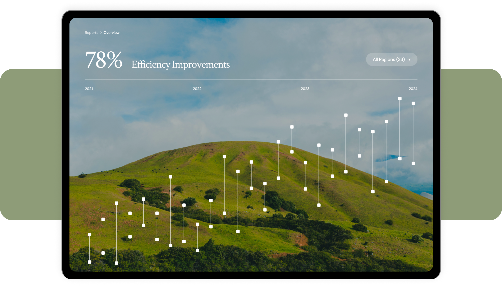

<<<<<<< HEAD
# figmaMCP
figma原型生成网站
=======
# Area — Modern Product Launch

基于 [Figma 社区模板 Modern Product Launch](https://www.figma.com/community/file/1487309170684591074/modern-product-launch) 开发的产品发布落地页。

## 预览



## 技术栈

- **React 19** — 组件化 UI
- **Vite 6** — 构建与开发服务器
- **Tailwind CSS 3** — 原子化样式
- **PostCSS + Autoprefixer** — CSS 后处理

## 设计系统

所有设计 Token 从 Figma 文件中提取：

| Token | 值 |
|-------|-----|
| 背景色 | `#FFFFFF` |
| Accent 1（深绿） | `#485C11` |
| Accent 2（浅绿） | `#DFECC6` |
| Mid Green | `#8E9C78` |
| Headline | `#000000` |
| Paragraph | `#6F6F6F` |
| Dividers | `#E9E9E9` |

| 字体 | 用途 |
|------|------|
| Crimson Text (serif) | Display / H1 / H2 / H3 标题 |
| DM Sans (sans-serif) | 正文 / 链接 / 按钮 / Logo |
| Roboto Mono (mono) | 图注 / 标注 |

## 页面结构

1. **Navigation** — 品牌 Logo + 浮动毛玻璃胶囊导航栏 + CTA 按钮
2. **Header** — "Browse everything." 超大 Display 标题 + iPad 设备 Hero 图
3. **Trusted by** — 6 个合作伙伴 Logo
4. **Benefits** — 分割线布局，图标 + 标题 + 描述列表
5. **Features** — 左右分栏（标题 + 编号列表 | 大图）
6. **Specs** — 3 列对比表格（Area / WebSurge / HyperView）
7. **Testimonial** — 左侧大图 + 右侧引用
8. **How-to** — 3 步骤卡片（大号灰色数字）
9. **CTA** — "Connect with us" 联系区域
10. **Footer** — 导航链接 + Logo + 版权信息

## 快速开始

```bash
# 安装依赖
npm install

# 启动开发服务器
npm run dev

# 构建生产版本
npm run build

# 预览构建结果
npm run preview
```

## 目录结构

```
├── public/
│   └── images/          # Figma 导出的图片素材
├── src/
│   ├── components/      # React 组件
│   │   ├── Navbar.jsx
│   │   ├── Header.jsx
│   │   ├── TrustedBy.jsx
│   │   ├── Benefits.jsx
│   │   ├── Features.jsx
│   │   ├── Specs.jsx
│   │   ├── Testimonial.jsx
│   │   ├── HowTo.jsx
│   │   ├── HeroBottom.jsx
│   │   ├── Contact.jsx
│   │   └── Footer.jsx
│   ├── App.jsx          # 根组件
│   ├── main.jsx         # 入口
│   └── index.css        # Tailwind 入口
├── index.html
├── tailwind.config.js
├── postcss.config.js
└── vite.config.js
```

## License

ISC
>>>>>>> fddf0eb (Ñϸñ¶ÔÆë Figma ԭÐÍÖع¹ҳÃ棬²¢²¹Æ빤³̻ù´¡ÅäÖÃÓë˵Ã÷Îĵµ¡£)
